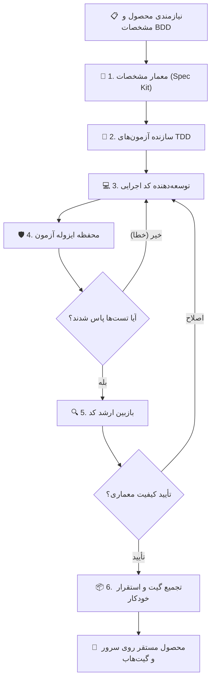

# TradingChart Markdown

[](https://github.com/98H)
[](https://github.com/98H)
[](https://github.com/98H)
[](/preview/prod-tradingchart-markdown-4088a9/)

## 🎯 معرفی محصول و هدف راهبردی
> Full TradingView substitute

این محصول به صورت کاملاً خودگردان و مبتنی بر چرخه حیات چابک ۲۴/۷ توسط **نکسوس ایجنت گراف (Nexus Agent Graph)** معماری، آزمون و مستقر شده است.

## 🚀 استقرار زنده و دسترسی به سامانه
- **پیوند دسترسی زنده (Live Preview):** [/preview/prod-tradingchart-markdown-4088a9/](/preview/prod-tradingchart-markdown-4088a9/)
- **مستندات مشروح استقرار:** [docs/DEPLOYMENT.md](docs/DEPLOYMENT.md)
- **مشخصات نیازمندی‌های سیستم:** [.specify/memory/constitution.md](.specify/memory/constitution.md)

## 🏛️ معماری سیستم و نمودار جریان داده (StateGraph)


## 📊 وضعیت پیشرفت بک‌لاگ چابک
- **اپیک‌ها (Epics):** 0 مورد
- **تسک‌های مهندسی (Tasks):** 0 مورد
- **داستان‌های کاربری (Stories):** 0 مورد (تکمیل‌شده: 0)

## 💻 راه‌اندازی و اجرای محلی
```bash
# ۱. کلون ریپازیتوری
git clone https://github.com/98H/nexus-tradingchart-markdown.git
cd nexus-tradingchart-markdown

# ۲. آماده‌سازی محیط پایتون
python3 -m venv .venv
source .venv/bin/activate

# ۳. نصب وابستگی‌ها و اجرای تست‌ها
pytest tests/

# ۴. اجرای وب‌سرویس یا پیش‌نمایش محصول
python3 app.py
```

## 🛡️ اصالت و مهندسی خودگردان
- **کارخانه نرم‌افزار خودگردان:** Nexus Agent Graph Engine
- **توسعه‌دهنده ارشد و معمار سیستم:** Hossein Mohammadi ([@98H](https://github.com/98H))
- **تاریخ آخرین همگام‌سازی:** 2026-09-19 16:16:26 UTC